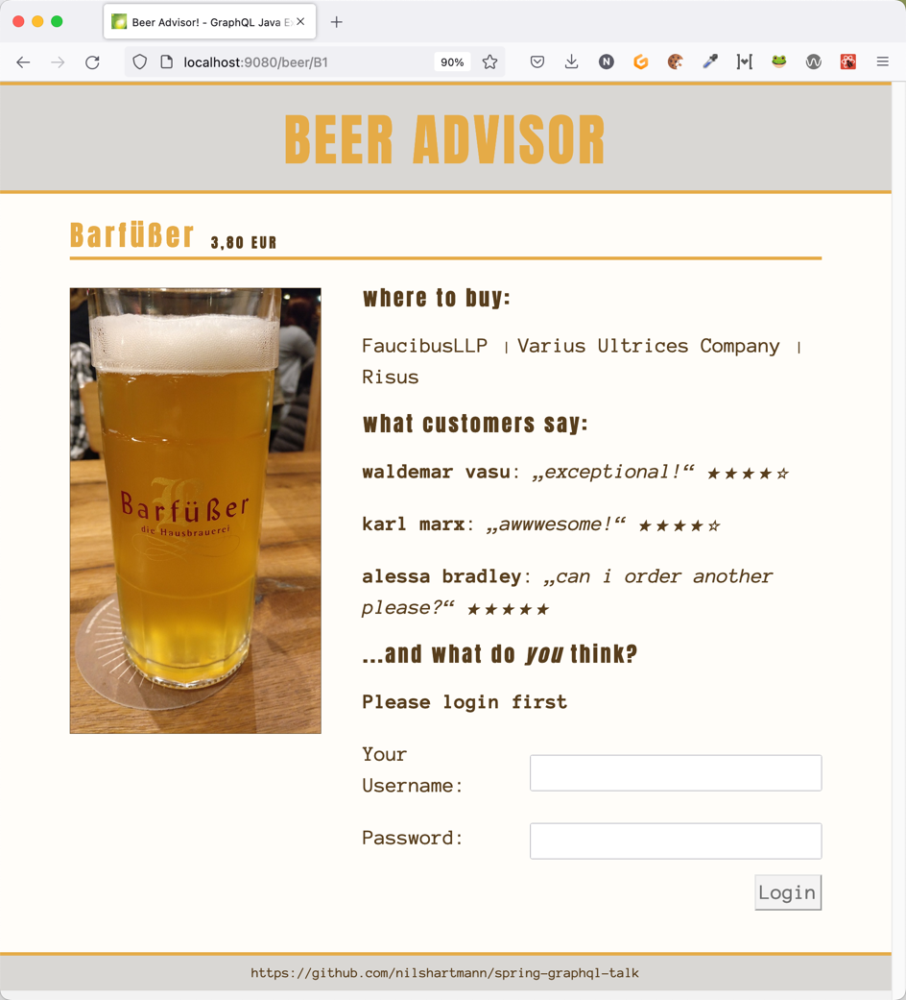

# spring-graphql example application

This repository contains my "BeerAdvisor" GraphQL sample application, built with spring-graphql.

* `beeradvisor`: complete app with react frontend. Please see `README.md` in that folder for further information.
* `workspace`: beeradvisor without graphql, ready for live coding GraphQL examples

Enjoy 🍻

## Questions, Feedback

If you have questions or feedback, do not hesitate to contact me!

Have fun,

Nils (Twitter: [@nilshartmann](https://twitter.com/nilshartmann)))

https://nilshartmann.net

