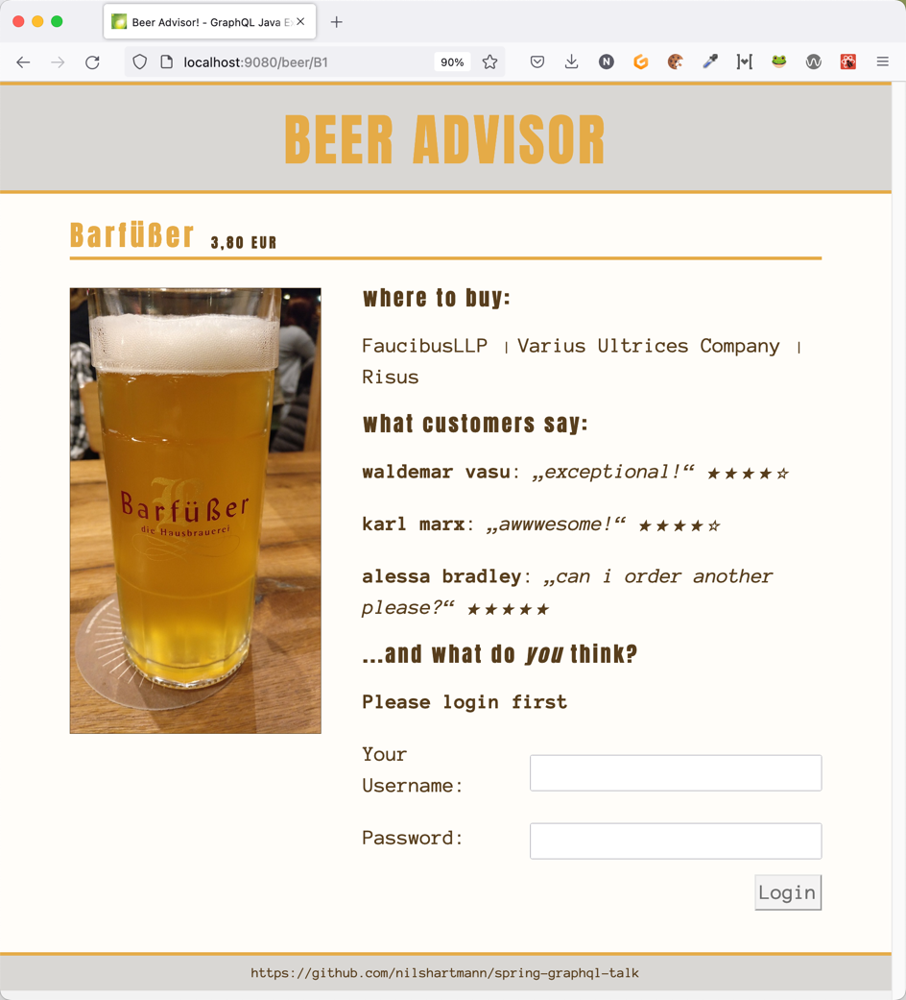

# spring-graphql example application

This repository contains my "BeerAdvisor" GraphQL sample application, built with spring-graphql.

* `beeradvisor`: complete app with react frontend. Please see `README.md` in that folder for further information.
* `workspace`: BeerAdvisor without graphql, ready for live coding GraphQL examples

On branch [`schritte`](https://github.com/nilshartmann/spring-graphql-talk/commits/schritte/) you can find step-by-step commits, each demonstrating a single Spring GraphQL feature. 

Enjoy 🍻

## Questions, Feedback

If you have questions or feedback, do not hesitate to [contact me](https://nilshartmann.net/contact)!

More on my GraphQL workshops: https://nilshartmann.net/graphql

Have fun,

Nils

https://nilshartmann.net

