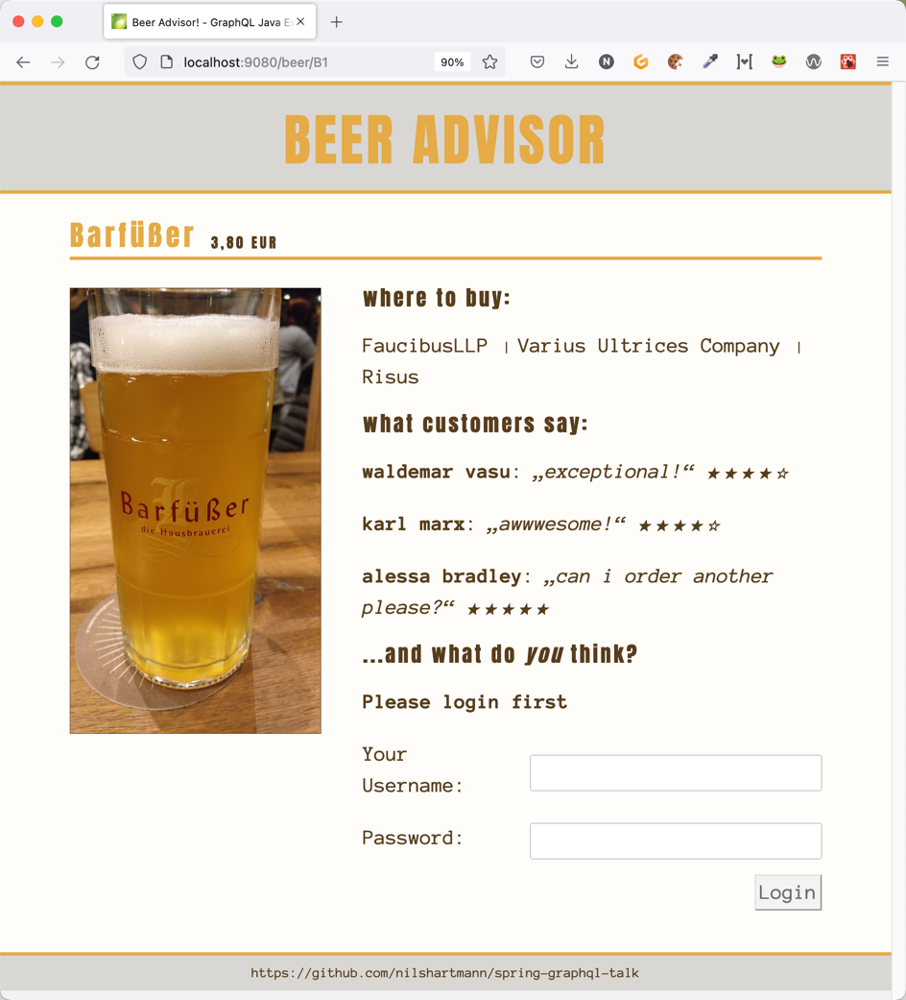

# GraphQL Example Application "Beer Advisor"

To run the application:

- Open in your IDE
- Compile
- Run Spring Boot application in `userservice`
- Run Backend application in `backend` (this provides the domain logic and GraphQL API)

- Access GraphiQL, the graphql web explorer,  at: `http://localhost:9000`

If you like to, you can also open the React frontend:
- run `yarn install` in `frontend`
- run `yarn start` in `frontend`
- open the browser at `http://localhost:9080`

Enjoy 🍻

## Login / Users

To add new ratings for a Beer you need to login.

You can do either:

- if you're in the frontend, use one of the following users names: "waldemar","karl", "alessa", "lauren" or "nils" and use any string longer than five chars as password
- if you're using GraphiQL and want to run a mutation, you can find a header with JSON Web Token (JWT) in the console log from the backend process 
  when the backend process starts (Search for `NEVER EXPIRING JWT TOKEN`. Copy this header to the `Request Headers` tab at the bottom of the page in GraphiQL.

## Questions, Feedback

If you have questions or feedback, do not hesitate to contact me!

Have fun,

Nils (Twitter: [@nilshartmann](https://twitter.com/nilshartmann)))

https://nilshartmann.net
